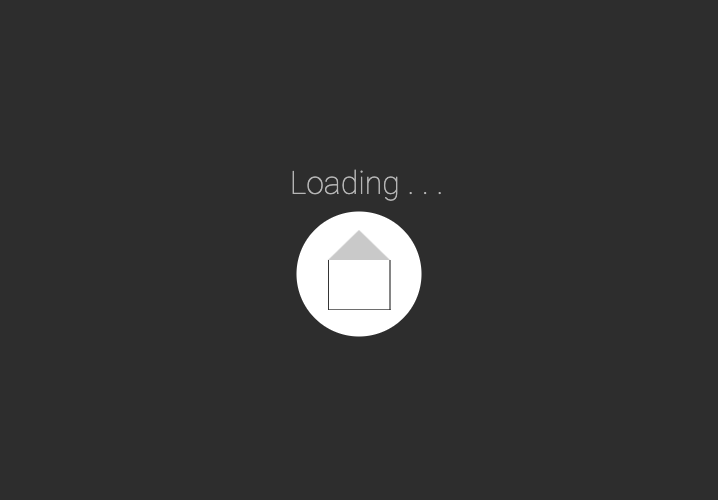
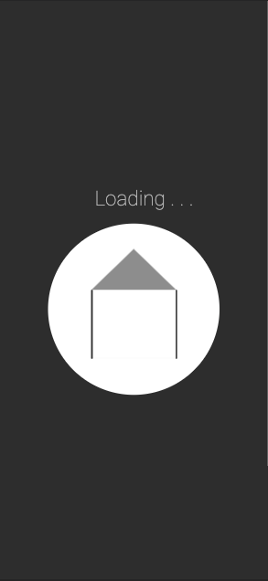
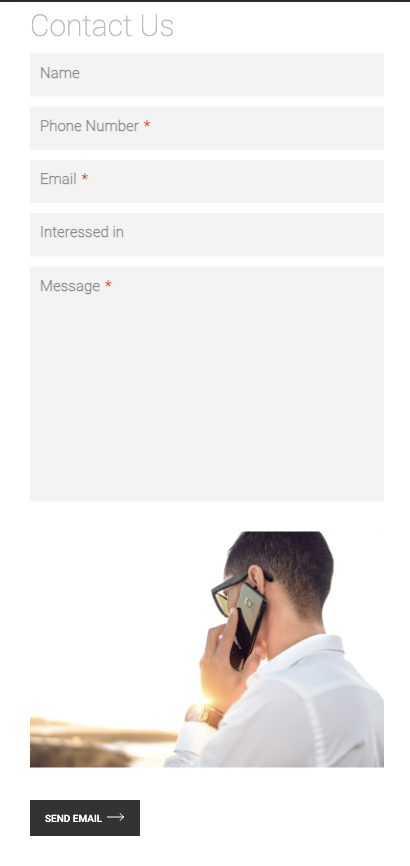
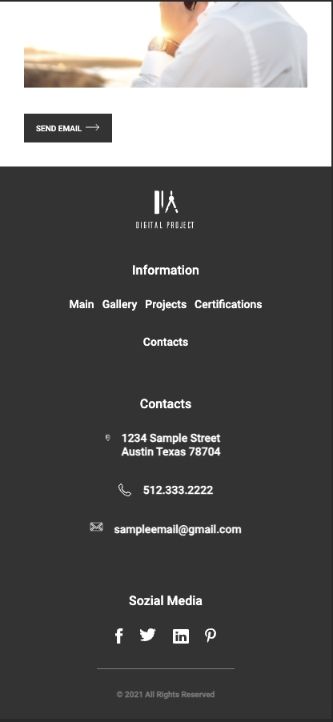

# Architect-Portfolio (Dektop, Tablet, Mobile)-

Light/Dark & Loading Page

# [Netlify Deployment](https://spiffy-faloodeh-108a9f.netlify.app/)

# DESKTOP (LIGHT/DARK)

# TABLET (LIGHT/DARK)

# MOBILE (LIGHT/DARK)

# Process flow chart:

